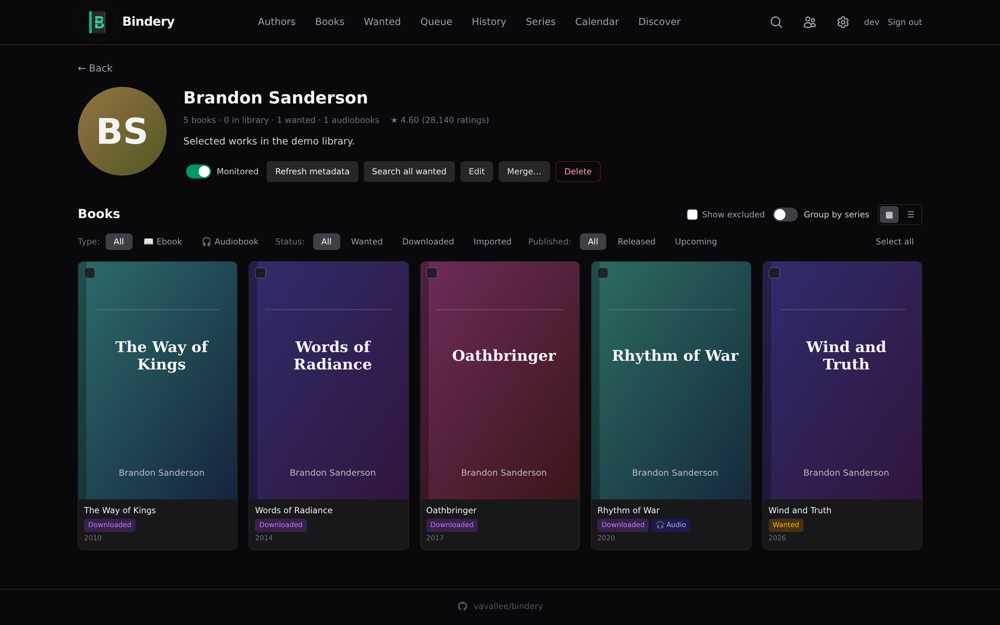
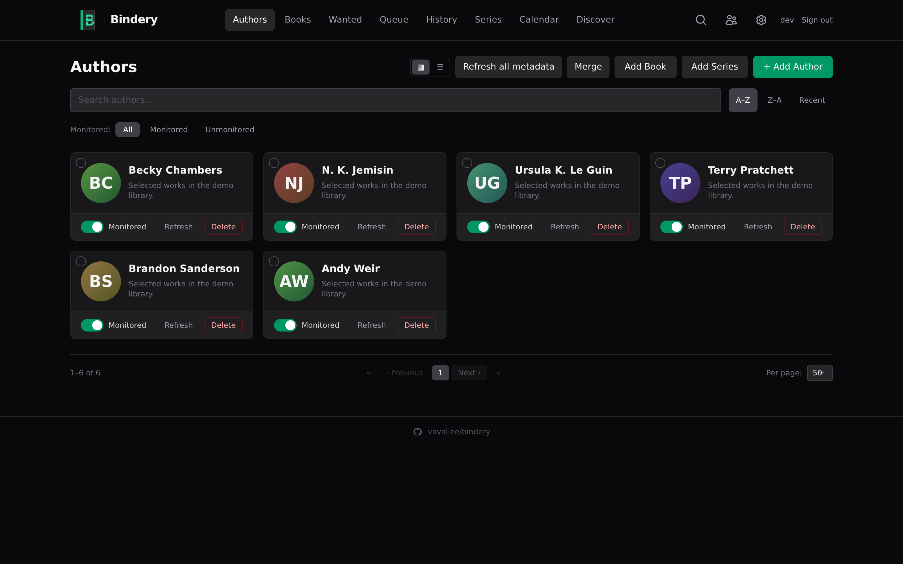

<p align="center">
  
</p>

<h1 align="center">Bindery</h1>

<p align="center">
  <strong>Automated book download manager for Usenet & Torrents</strong><br>
  Monitor authors. Search indexers. Download. Organize. Done.
</p>

<p align="center">
  <a href="https://github.com/vavallee/bindery/actions/workflows/ci.yml"></a>
  <a href="https://codecov.io/gh/vavallee/bindery"></a>
  <a href="https://github.com/vavallee/bindery/releases"></a>
  <a href="https://github.com/vavallee/bindery/pkgs/container/bindery"></a>
  <a href="https://goreportcard.com/report/github.com/vavallee/bindery"></a>
  <a href="https://github.com/vavallee/bindery/blob/main/LICENSE"></a>
  <a href="https://discord.gg/RpuYYRM9cZ"></a>
</p>

---

<p align="center">
  
</p>

<p align="center">
  
</p>

<p align="center">
  
</p>

<h4 align="center">Mobile-friendly</h4>

<p align="center">
  <picture>
    <source media="(prefers-color-scheme: dark)" srcset="docs/screenshots/books-mobile-dark.png">
    <source media="(prefers-color-scheme: light)" srcset="docs/screenshots/books-mobile-light.png">
    
  </picture>
  &nbsp;&nbsp;&nbsp;
  <picture>
    <source media="(prefers-color-scheme: dark)" srcset="docs/screenshots/authors-mobile-dark.png">
    <source media="(prefers-color-scheme: light)" srcset="docs/screenshots/authors-mobile-light.png">
    
  </picture>
  &nbsp;&nbsp;&nbsp;
  <picture>
    <source media="(prefers-color-scheme: dark)" srcset="docs/screenshots/author-detail-mobile-dark.png">
    <source media="(prefers-color-scheme: light)" srcset="docs/screenshots/author-detail-mobile-light.png">
    
  </picture>
</p>

---

## Why Bindery?

**Readarr is dead.** The official project was archived in June 2025 and its metadata backend (`api.bookinfo.club`) is permanently offline. Community forks rely on fragile Goodreads scrapers that break regularly. There was no reliable, open-source tool for automated book management on Usenet.

**Bindery is the clean-room replacement.** Built from scratch in Go with a modern React UI, Bindery uses only stable, documented public APIs for book metadata. No scraping. No dead backends. No fragile dependencies.

## Features

**Library management**
- Author monitoring via OpenLibrary's author-works endpoint, configurable author monitor modes for all/future/latest/none defaults, per-book monitor toggles, and a `wanted → downloading → downloaded → imported` workflow.
- Dual-format books — each title holds an ebook *and* an audiobook in independent slots, with separate search, grab, and import pipelines, and the audiobook side moves multi-part `.m4b` / `.mp3` folders as one unit.
- Series support with position tracking, edition tracking (format / ISBN / publisher / page count), Calendar view of upcoming releases, and multiple library roots.
- Library scan with four-tier matching: ASIN → title + author → series name + position → fuzzy title. Honours librarian sort-suffix form (`Title, The`) and series-annotated filenames (`[Mistborn, Book 1]`).
- Author aliases (`RR Haywood` / `R.R. Haywood` / `R R Haywood` merge into one canonical row), and metadata re-bind to correct a wrong match without delete-and-re-add.

**Search & downloads**
- Newznab + Torznab indexers queried in parallel, deduplicated, then composite-ranked by format quality, edition tags (RETAIL / UNABRIDGED / ABRIDGED), year match, grab count, size, and ISBN exact-match bonus.
- Smart matching — four-tier query fallback (`t=book` → `surname+title` → `author+title` → title), word-boundary keyword matching, contiguous-phrase requirement for multi-word titles, dual-author-anchor for ambiguous short titles, subtitle-aware (`Title: Subtitle`).
- SABnzbd, NZBGet, qBittorrent, Transmission, Deluge — with **Use SSL** and **URL Base** for reverse-proxy subpaths.
- Auto-grab sweep every 12h, immediate search on add or `wanted` flip, plus interactive per-book search and "Search all wanted" per author. Global kill-switch pauses auto-grab without losing your monitored list.
- Quality profiles (EPUB / MOBI / AZW3 / PDF), language filter, regex-based custom formats, delay profiles, blocklist (consulted on every search; one-click add from History), and failure visibility in Queue and History.

**Import & organize**
- Completed downloads matched by NZO ID and placed in the library with configurable naming. Modes: **Move** (default), **Copy** (keep source for seeding), **Hardlink** (zero extra disk; same filesystem required).
- Naming tokens — `{Author}`, `{SortAuthor}`, `{Title}`, `{Year}`, `{Series}`, `{SeriesNumber}`, `{ext}` — collapse cleanly for non-series books.
- Cross-filesystem-safe moves: atomic rename when possible, copy + verify + delete for NFS / separate volumes. Full grab / import / failure history per book.
- Calibre integration in three modes: `calibredb` CLI hook on import, [Bindery Bridge plugin](https://github.com/vavallee/bindery-plugins) (cross-container), or direct read of an existing Calibre library's `metadata.db` as Bindery's catalogue.

**Metadata sources** — all stable, documented, public APIs. No Goodreads scraping.

| Source | Auth | Used for |
|--------|------|----------|
| [OpenLibrary](https://openlibrary.org) | None | Primary: authors, books, editions, covers, ISBN |
| [Google Books](https://developers.google.com/books) | API key (free) | Enrichment: descriptions, ratings |
| [Hardcover.app](https://hardcover.app) | None (public GraphQL) | Enrichment: community ratings, series, wishlist |
| [DNB](https://www.dnb.de/) | None (public SRU) | German-language descriptions, language, year, publisher; can be promoted to **primary** |
| [Audnex](https://api.audnex.us) | None | Audiobook narrator, duration, cover by ASIN |
| [Audible](https://audible.com) | None | Supplemental audiobook author lookup — pulls ASINs OL/Hardcover miss |

Cover images are fetched and cached server-side under `<dataDir>/image-cache/` (30-day TTL). Every `imageURL` is rewritten to `/api/v1/images?url=...` before leaving the server — the browser never contacts third-party image hosts directly.

**Discover** — personalised recommendations on the **Discover** page from multiple signals: next-in-series for what you're reading, new releases from monitored authors, genre similarity (≥ 20 books in library), OpenLibrary subject popular picks, and Hardcover wishlist cross-reference. Recency scoring is relative to the *median* publication year of your library, so backlist readers aren't penalised. Hard-filters owned, dismissed, excluded-author, wrong-language, fewer-than-50-ratings, sub-3.0-rated, and omnibus titles. Dismiss / exclude actions persist.

**Migration** — upload `readarr.db` directly (authors re-resolved against OpenLibrary since `bookinfo.club` is dead; indexers, download clients, and blocklist port structurally), or paste a newline-separated list of author names. CLI: `bindery migrate {csv,readarr} <path>` for first-time bulk imports without opening the UI.

**Operations**
- **Authentication** — first-run setup creates an admin account (argon2id, signed session cookies). Four modes: **Enabled** / **Local only** (bypass for private IPs) / **Disabled** / **Proxy** (trust upstream `X-Forwarded-User` from a configured trusted proxy — drop-in for Authelia / Authentik / oauth2-proxy). Per-account API key, per-IP login rate limiting, CSRF double-submit (API-key clients exempt).
- **OIDC** — native Authorization Code + PKCE with multi-provider support. Pre-configured for Google, GitHub (via Dex), Authelia, and Keycloak; identifies users by stable `(issuer, sub)` so email/username changes don't break logins.
- **Multi-user mode** — per-user libraries, monitored authors, profiles, and downloads. Admin role manages indexers / download clients / users; standard users see only their own catalogue. Local, OIDC-provisioned, or forward-auth-mapped.
- **Webhook notifications** for grab / import / failure (pipe to Apprise, ntfy, Home Assistant, Discord, Slack via proxies). **Tags** scope indexers / profiles / notifications to specific authors. **On-demand SQLite backups.** **Persistent log viewer** in Settings → Logs with runtime DEBUG toggle.
- **Arr-compatible queue** at `GET /api/queue` for [Harpoon](https://github.com/harpoon-io/harpoon) and other *arr-aware tools — pagination, sort, live size, status, client, remote ID, protocol.

**UI**
- Modern React 19 + TypeScript + Tailwind CSS SPA with deep-linkable routed `/book/:id` and `/author/:id` pages.
- Light / dark themes (respecting `prefers-color-scheme` first paint), grid / table view toggles, mobile-friendly responsive layout, hamburger nav, agenda-style mobile Calendar.
- Full pagination, search, filter, and sort on every list page; preferences persist to `localStorage`.
- 7 languages — English, French, German, Dutch, Spanish, Filipino (Tagalog), Indonesian — auto-detected from the browser, override in Settings.
- **OPDS 1.2 catalogue** at `/opds/` for KOReader, Moon+ Reader, and other reading apps. HTTP Basic auth with the API key as the password.

**Packaging** — single Go binary with the React frontend embedded via `go:embed`. Distroless container (non-root, read-only rootfs, all caps dropped, RuntimeDefault seccomp). Helm chart for ArgoCD / Flux. Pure-Go SQLite via `modernc.org/sqlite` — no CGO, no external database.

## Quick Start

### Docker

```bash
docker run -d \
  --name bindery \
  -p 8787:8787 \
  -v /path/to/config:/config \
  -v /path/to/books:/books \
  -v /path/to/downloads:/downloads \
  ghcr.io/vavallee/bindery:latest
```

Open <http://localhost:8787>, follow the first-run setup to create the admin account, and you're in.

### Docker Compose

```yaml
services:
  bindery:
    image: ghcr.io/vavallee/bindery:latest
    container_name: bindery
    ports:
      - 8787:8787
    volumes:
      - ./config:/config
      - /media/books:/books
      - /media/downloads:/downloads
    environment:
      - BINDERY_LOG_LEVEL=info
    restart: unless-stopped
```

### Other install methods

Pre-built binaries for Linux / macOS / Windows (amd64, arm64, armv7, armv6), Kubernetes (Helm chart at `charts/bindery/`), and the Unraid Community Applications template are all covered in **[docs/DEPLOYMENT.md](docs/DEPLOYMENT.md)** — including UID/GID setup, path remapping for multi-container deployments, the full environment-variable reference, and per-version upgrade notes.

## Configuration

Bindery is configured through the web UI under **Settings** — indexers, download clients, quality profiles, naming, notifications, auth, and everything else runtime-tunable lives there. A small set of bootstrap-only knobs are environment variables:

| Variable | Default | Purpose |
|----------|---------|---------|
| `BINDERY_PORT` | `8787` | HTTP server port |
| `BINDERY_DB_PATH` | platform-default | SQLite database path |
| `BINDERY_DATA_DIR` | platform-default | Config directory (backups, image cache, secrets) |
| `BINDERY_LIBRARY_DIR` | `/books` | Imported ebook destination |
| `BINDERY_AUDIOBOOK_DIR` | inherits library | Imported audiobook destination |
| `BINDERY_DOWNLOAD_DIR` | `/downloads` | Where the download client deposits completed jobs |
| `BINDERY_AUDIOBOOK_DOWNLOAD_DIR` | inherits download dir | Separate watch folder for audiobook downloads |
| `BINDERY_URL_BASE` | _(empty)_ | Reverse-proxy subpath (e.g. `/bindery`) |
| `BINDERY_PUID` / `PGID` | _(unset)_ | Sanity-check assertions for the container UID/GID |

The full reference (path remapping, API-key seeding, telemetry, trusted-proxy, rate-limit knobs, cookie-Secure policy) is in **[docs/DEPLOYMENT.md#environment-variables](docs/DEPLOYMENT.md#environment-variables)**. OIDC and forward-auth proxy variables live in **[docs/auth-oidc.md](docs/auth-oidc.md)** and **[docs/auth-proxy.md](docs/auth-proxy.md)**.

## Supported integrations

| Category | Implementations |
|---|---|
| **Usenet clients** | SABnzbd, NZBGet |
| **Torrent clients** | qBittorrent, Transmission, Deluge |
| **Indexers** | Newznab (NZBGeek, NZBFinder, NZBPlanet, DrunkenSlug, …), Torznab (Prowlarr, Jackett, direct endpoints), with per-indexer category overrides |
| **Notifications** | Generic webhooks — pipe to Apprise / ntfy / Home Assistant / Slack / Discord |
| **Authentication** | Local (argon2id), API key, OIDC (Google, GitHub via Dex, Authelia, Keycloak, …), forward-auth proxy |
| **Reading apps** | OPDS 1.2 catalogue at `/opds/` (KOReader, Moon+ Reader, Aldiko, …) |

All download clients support **Use SSL** and **URL Base** for connections through a reverse-proxy subpath.

## Architecture

Bindery is a single Go binary (chi router, distroless container) with the React 19 + TypeScript frontend embedded via `go:embed`, talking to SQLite in WAL mode through the pure-Go `modernc.org/sqlite` driver — no CGO, no external database, no sidecars.

```
   Newznab / Torznab
      indexers
         │
         ▼
┌────────────────────────────┐
│         Bindery            │──► SABnzbd / NZBGet / qBittorrent / Transmission / Deluge
│  Go backend + React SPA    │──► /books/ library
│  SQLite (WAL mode)         │──► Webhook notifications
└────────────────────────────┘
    ▲                    ▲
    │                    │
OpenLibrary      Google Books, Hardcover.app, DNB, Audnex, Audible
 (primary)                 (enrichers)
```

Component breakdown, package layout, concurrency model, and design rationale are in **[docs/ARCHITECTURE.md](docs/ARCHITECTURE.md)**.

## API

Every feature is exposed under `/api/v1/*`, with an arr-compatible `/api/queue` for external tools and an OPDS catalogue at `/opds/`. Quick taste:

```bash
# Add an author by OpenLibrary ID and start monitoring
curl -X POST -H "X-Api-Key: $KEY" -H "Content-Type: application/json" \
  -d '{"foreignAuthorId":"OL23919A","monitored":true,"searchOnAdd":true}' \
  http://bindery:8787/api/v1/author

# List wanted books
curl -H "X-Api-Key: $KEY" "http://bindery:8787/api/v1/book?status=wanted"
```

The full endpoint catalogue, authentication rules (API key, session cookie, local-only, OIDC, proxy), CSRF semantics, and integration examples are in **[docs/API.md](docs/API.md)**.

## Documentation

| Topic | Where |
|-------|-------|
| **Quickstart** — zero to first download, end to end | [docs/QUICKSTART.md](docs/QUICKSTART.md) |
| **Quickstart (wiki)** — first author to first grab in 10 minutes | [Wiki](https://github.com/vavallee/bindery/wiki/Quickstart) |
| **Deployment** — Docker, Compose, k8s/Helm, binary, UID/GID, env vars, upgrades | [docs/DEPLOYMENT.md](docs/DEPLOYMENT.md) |
| **Architecture** — components, data flow, dependencies | [docs/ARCHITECTURE.md](docs/ARCHITECTURE.md) |
| **API** — REST endpoints, auth, integration patterns | [docs/API.md](docs/API.md) |
| **Roadmap** — planned work and explicitly-out-of-scope items | [docs/ROADMAP.md](docs/ROADMAP.md) |
| **Multi-user** — roles, user management, CSRF tokens | [docs/multi-user.md](docs/multi-user.md) |
| **Upgrading to v1.0** — multi-user migration: backup, dry-run, rollback | [docs/upgrade-v1.md](docs/upgrade-v1.md) |
| **OIDC auth** — Google / GitHub / Authelia / Keycloak setup | [docs/auth-oidc.md](docs/auth-oidc.md) |
| **Forward-auth (proxy) auth** — Authelia / Authentik / oauth2-proxy | [docs/auth-proxy.md](docs/auth-proxy.md) |
| **Auth troubleshooting** — symptom → cause → fix across all auth modes | [docs/troubleshooting-auth.md](docs/troubleshooting-auth.md) |
| **ABS import (overview)** — what gets imported, setup, review queue, rollback | [docs/ABS-Import-Wiki.md](docs/ABS-Import-Wiki.md) |
| **ABS import (reference)** — implementation detail, mapping rules, API surface | [docs/abs_import.md](docs/abs_import.md) |
| **Enhanced Hardcover series** — token setup, series linking, catalog diffs, missing-book fill | [docs/Hardcover-Series-Wiki.md](docs/Hardcover-Series-Wiki.md) |
| **Storage & hardlinks** — single-mount layout, import modes, per-author audiobook root | [docs/Storage-And-Hardlinks-Wiki.md](docs/Storage-And-Hardlinks-Wiki.md) |
| **Migrating from Readarr** — `readarr.db` import, Goodreads CSV import, library scan | [docs/Migrating-From-Readarr-Wiki.md](docs/Migrating-From-Readarr-Wiki.md) |
| **Troubleshooting** — permission-denied, path-remap, import failures | [docs/Troubleshooting-Wiki.md](docs/Troubleshooting-Wiki.md) |
| **Contributing & CI checks** — dev setup, full quality/security matrix, local check suite | [CONTRIBUTING.md](CONTRIBUTING.md) |
| **Changelog** — release notes | [CHANGELOG.md](CHANGELOG.md) |
| **Reverse-proxy & SSO setups** — Traefik / Caddy / Nginx / Authelia / Authentik recipes | [Wiki](https://github.com/vavallee/bindery/wiki/Reverse-proxy-and-SSO) |
| **Indexer & download-client recipes** — NZBGeek / DrunkenSlug / Prowlarr / Jackett / SAB / qBit tips | [Wiki](https://github.com/vavallee/bindery/wiki/Indexer-and-downloader-recipes) |

## Community

- **Discord** — real-time help, setup questions, release chat: [discord.gg/RpuYYRM9cZ](https://discord.gg/RpuYYRM9cZ). The `#support` channel is the best place to ask; `#changelog` is updated on every release. The three read-only voice channels at the top of the server show live active-install count, latest release, and GitHub star count, refreshed from the telemetry API every 10 minutes.
- **GitHub Issues** — bug reports and feature requests: [issues](https://github.com/vavallee/bindery/issues).
- **GitHub Discussions** — open-ended design questions, show-and-tell, integration recipes: [discussions](https://github.com/vavallee/bindery/discussions).

Please keep security reports out of Discord and public issues — see [SECURITY.md](SECURITY.md) for the private disclosure channel.

## Security

<p>
  <a href="https://github.com/vavallee/bindery/security/code-scanning"></a>
  <a href="https://securityscorecards.dev/viewer/?uri=github.com/vavallee/bindery"></a>
  <a href="https://github.com/vavallee/bindery/security/dependabot"></a>
  <a href="SECURITY.md"></a>
</p>

Bindery holds API keys, reaches LAN services, and writes to disk — we take that seriously. Every push and weekly cron runs gosec, govulncheck, Semgrep, gitleaks, Trivy, Grype, Dockle, Syft, ZAP baseline, and OpenSSF Scorecard, with findings published as SARIF in GitHub's Security tab. Release images ship with SLSA build provenance and Syft SBOMs. In-app: SSRF guards on every outbound URL, hardened response headers (CSP, frame-deny, referrer-policy, auto-HSTS), distroless non-root read-only rootfs container with all caps dropped, and digest-pinned base images.

To report a vulnerability, follow the process in **[SECURITY.md](SECURITY.md)**. The full threat model and verification recipes live on the [wiki Security page](https://github.com/vavallee/bindery/wiki/Security).

## Telemetry

Bindery sends one anonymous ping per day to [api.getbindery.dev](https://api.getbindery.dev) so the maintainer can count active installs. The payload contains a random `install_id` (generated on first run), the binary `version`, `os`, and `arch` — no hostnames, IP addresses, library contents, or personal data. The response carries the latest published version, used for in-app update notifications. Opt out with `telemetry.enabled: false` in **Settings → General**, or `BINDERY_TELEMETRY_DISABLED=true` before first run.

## Contributing

PRs, issues, and feedback welcome. See **[CONTRIBUTING.md](CONTRIBUTING.md)** for the dev setup, the full local check suite, and the PR flow. Tracked feature work lives in **[docs/ROADMAP.md](docs/ROADMAP.md)** — open an issue before starting anything substantial.

## License

MIT. See [LICENSE](LICENSE) for details.

## Acknowledgments

- The [*arr community](https://wiki.servarr.com/) for pioneering the monitor-search-download-import pattern
- [OpenLibrary](https://openlibrary.org) for free, open book metadata
- The Readarr project for the original vision, even though the implementation couldn't be sustained
